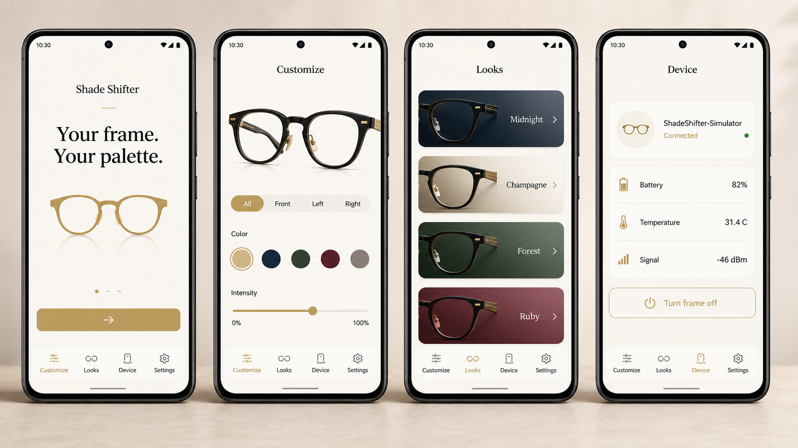

<div align="center">

# Shade Shifter

### Your frame. Your palette.

A simulator-first smart-eyewear platform for exploring app-controlled frame colors, zones, looks, and safe Bluetooth hardware control.

[](https://github.com/AnkitParekh007/shade-shifter/actions/workflows/mobile-app.yml)
[](software/mobile-app)
[](documentation/mobile-app/IMPLEMENTATION-STATUS.md)

[Product concept](https://shade-shifter.akki77parekh.chatgpt.site/) · [Mobile setup](documentation/mobile-app/SETUP.md) · [Build blueprint](hardware/blueprint-plan/BUILD-BLUEPRINT.md) · [BLE protocol](documentation/mobile-app/BLE-PROTOCOL.md)

</div>



> The image above is a design preview of the implemented Android experience, not a photograph of production hardware.

## What is Shade Shifter?

Shade Shifter is an open prototype for eyewear whose visible appearance can be controlled from a phone. The project combines a premium Flutter companion app, an ESP32 Bluetooth proof of concept, addressable RGB lighting, early CAD, purchasing research, and a gated wearable-hardware build plan.

The current goal is to answer the difficult questions early: Can a phone control the frame reliably? Can separate frame areas feel expressive rather than gimmicky? Can the electronics remain cool, diffused, comfortable, and safe enough to justify a later wearable revision?

## Android app experience

The Flutter app works without hardware from the first launch. Choose **Try simulator** to explore the complete product flow, then use **Pair physical frame** when an ESP32 Rev A bench device is available.

| Experience | What it provides |
|---|---|
| **Customize** | Whole-frame or front/left/right zone selection, curated colors, hex input, linked zones, safe intensity, undo/redo, immediate preview, and off control |
| **Looks** | Curated styles plus locally saved, duplicated, applied, and deleted personal looks |
| **Device** | Connection state, protocol profile, battery, temperature, signal, last command, safety state, disconnect, and off |
| **Settings** | Accessibility, privacy, diagnostics, simulator guidance, safety information, and onboarding reset |

The app includes a CAD-derived GLB preview with separately addressable `front`, `left_temple`, and `right_temple` meshes. Unsupported devices automatically retain a polished 2D fallback.

## Hardware compatibility

The current Rev A firmware advertises `ShadeShifter-POC` and accepts exactly three raw RGB bytes. It controls the whole frame as one solid color and keeps brightness capped in firmware at `32/255` (12.5%).

The app is capability-aware: independent zones, gradients, effects, brightness control, telemetry, and acknowledgements are available in the simulator and future packet-v1 profile, but are not falsely presented as working on Rev A.

```text
Flutter app
  ├── Simulator transport ── full product capabilities
  └── BLE transport
        ├── Rev A legacy ─── [red, green, blue]
        └── Packet v1 ────── versioned commands + CRC16
```

## Safety-first prototype

This repository uses staged build gates instead of treating a wearable electronics prototype like an ordinary gadget project.

- Firmware remains the final authority for brightness and electrical safety.
- The app shows a thermal warning at 38 °C and a shutdown indication at 40 °C when telemetry is available.
- Early wearable tests use a certified USB power bank away from the face.
- Charging while worn is prohibited.
- Human wear follows bench, thermal, glare, fit, strain-relief, and independent-review checks.

This is not certified eyewear, a medical device, waterproof hardware, or a production-ready battery system.

## Repository map

| Path | Purpose |
|---|---|
| [`software/mobile-app`](software/mobile-app) | Flutter Android/iOS companion app, simulator, BLE, previews, persistence, and tests |
| [`hardware`](hardware) | Parts, suppliers, purchasing research, CAD/build package, firmware, BOM, and safety workflow |
| [`documentation/mobile-app`](documentation/mobile-app) | Architecture, setup, BLE specification, testing, release, privacy, accessibility, ADRs, and status |
| [`pitch`](pitch) | Investor presentation material |
| [`purchasing`](purchasing) | Visual purchasing checklists and staged buying guidance |

## Run the mobile app

Requirements: stable Flutter 3.44 or newer, Android SDK 24+, and a connected device or emulator. iOS builds require macOS and Xcode.

```bash
cd software/mobile-app
flutter pub get
flutter analyze
flutter test
flutter run
```

No account, API key, cloud backend, or physical frame is required for simulator mode.

## Current validation

- Flutter static analysis passes with no issues.
- Automated protocol, simulator, safety, and widget tests pass.
- GitHub Actions builds Android and performs an iOS no-codesign build.
- Rev A BLE behavior matches the checked-in ESP32 firmware contract.
- Physical Android/iPhone and ESP32 bench validation remains a documented hardware gate.

See [implementation status](documentation/mobile-app/IMPLEMENTATION-STATUS.md) for evidence and known limitations.

## Contributing

Start with the simulator for product or UI work. For BLE changes, preserve the `FrameTransport` boundary and add contract tests. For hardware changes, follow the build blueprint stage gates and update the protocol documentation whenever firmware behavior changes.

Please do not describe unverified concepts as production capabilities. Clearly distinguish simulator behavior, implemented firmware behavior, planned protocol features, and research.

## License and use

No production-use license or safety certification is implied by this repository. Treat all hardware files as experimental engineering material and obtain qualified electrical, mechanical, optical, and regulatory review before human-wear or commercial use.
