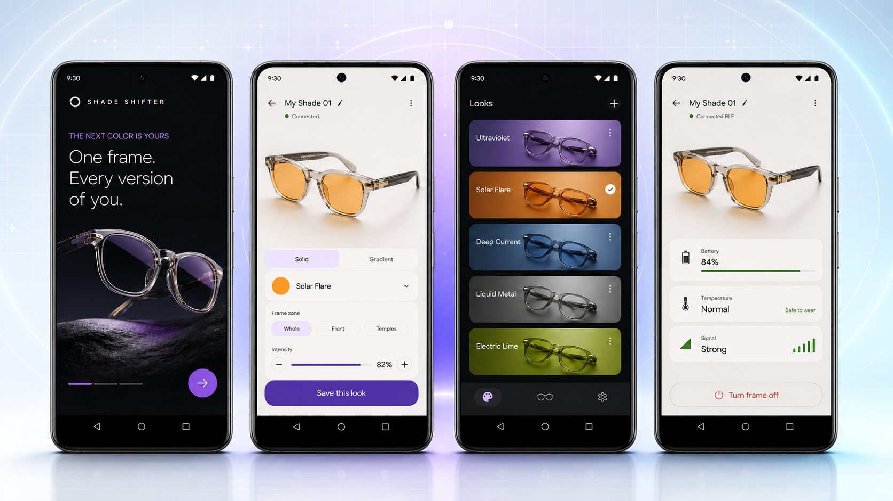

<div align="center">

# Shade Shifter

### One frame. Every version of you.

App-controlled eyewear that changes frame color on demand—from a quiet neutral to a vivid gradient in seconds.

[](https://github.com/AnkitParekh007/shade-shifter/actions/workflows/mobile-app.yml)
[](software/mobile-app)
[](documentation/mobile-app/IMPLEMENTATION-STATUS.md)

[Product concept](https://shade-shifter.akki77parekh.chatgpt.site/) · [Mobile setup](documentation/mobile-app/SETUP.md) · [Build blueprint](hardware/blueprint-plan/BUILD-BLUEPRINT.md) · [BLE protocol](documentation/mobile-app/BLE-PROTOCOL.md)

</div>



> The image above is a design preview of the implemented Android experience, not a photograph of production hardware.

## What is Shade Shifter?

Shade Shifter is building a new eyewear category: a premium, prescription-compatible frame whose appearance changes digitally—without clips, shells, or a drawer full of glasses. The project combines a Flutter companion app, an ESP32 Bluetooth experience proof of concept, addressable RGB lighting, early CAD, purchasing research, and a gated wearable-hardware build plan.

People change clothes, shoes, and watch faces to match the moment; eyewear has remained visually fixed. The current goal is to prove that a phone-controlled frame can become a convincing canvas while remaining reliable, cool, diffused, comfortable, and honest about the work still required for daily wear.

## Product vision

The roadmap deliberately separates the customer experience from the hardest material-science question.

| Track | Purpose |
|---|---|
| **Experience POC — RGB + light guide** | Prove fast, dramatic app control, Bluetooth reliability, thermal limits, fit, and customer desirability |
| **Product R&D — reflective color surface** | Pursue a sunlight-visible, low-power, premium material expression suitable for everyday eyewear |

The intended progression is **bench proof → wearable alpha → material breakthrough → India-first launch exploration**. Targets such as production weight, battery life, prescription compatibility, and launch colors remain goals until validated by engineering and testing.

## Android app experience

The Flutter app works without hardware from the first launch. Choose **Try simulator** to explore the complete product flow, then use **Pair physical frame** when an ESP32 Rev A bench device is available. The experience is designed around a simple rhythm: **choose, shift, wear**.
Customizable eyewear whose frame appearance can be restyled from a phone. The
first hardware POC uses an ESP32-compatible BLE controller with independently
controllable RGB zones; future revisions may use electrochromic or other
low-power color-changing materials.

| Experience | What it provides |
|---|---|
| **Customize** | Whole-frame or front/left/right zone selection, curated colors, hex input, linked zones, safe intensity, undo/redo, immediate preview, and off control |
| **Looks** | Curated concepts such as Ultraviolet, Solar Flare, Deep Current, Liquid Metal, and Electric Lime, plus locally saved personal looks |
| **Device** | Connection state, protocol profile, battery, temperature, signal, last command, safety state, disconnect, and off |
| **Settings** | Accessibility, privacy, diagnostics, simulator guidance, safety information, and onboarding reset |
## Repository layout

The app includes a CAD-derived GLB preview with separately addressable `front`, `left_temple`, and `right_temple` meshes. Unsupported devices automatically retain a polished 2D fallback.

## Hardware compatibility

The current Rev A firmware advertises `ShadeShifter-POC` and accepts exactly three raw RGB bytes. It controls the whole frame as one solid color and keeps brightness capped in firmware at `32/255` (12.5%).

The app is capability-aware: independent zones, gradients, effects, brightness control, telemetry, and acknowledgements are available in the simulator and future packet-v1 profile, but are not falsely presented as working on Rev A.

```text
Flutter app
  ├── Simulator transport ── full product capabilities
  └── BLE transport
        ├── Rev A legacy ─── [red, green, blue]
        └── Packet v1 ────── versioned commands + CRC16
```

## Safety-first prototype

This repository uses staged build gates instead of treating a wearable electronics prototype like an ordinary gadget project.

- Firmware remains the final authority for brightness and electrical safety.
- The app shows a thermal warning at 38 °C and a shutdown indication at 40 °C when telemetry is available.
- Early wearable tests use a certified USB power bank away from the face.
- Charging while worn is prohibited.
- Human wear follows bench, thermal, glare, fit, strain-relief, and independent-review checks.

This is not certified eyewear, a medical device, waterproof hardware, or a production-ready battery system.

## Repository map

| Path | Purpose |
|---|---|
| [`software/mobile-app`](software/mobile-app) | Flutter Android/iOS companion app, simulator, BLE, previews, persistence, and tests |
| [`hardware`](hardware) | Parts, suppliers, purchasing research, CAD/build package, firmware, BOM, and safety workflow |
| [`documentation/mobile-app`](documentation/mobile-app) | Architecture, setup, BLE specification, testing, release, privacy, accessibility, ADRs, and status |
| [`pitch`](pitch) | Investor presentation material |
| [`purchasing`](purchasing) | Visual purchasing checklists and staged buying guidance |

## Run the mobile app

Requirements: stable Flutter 3.44 or newer, Android SDK 24+, and a connected device or emulator. iOS builds require macOS and Xcode.

```bash
cd software/mobile-app
flutter pub get
flutter analyze
flutter test
flutter run
software/mobile-app/        Flutter app (Android + iOS) — simulator-first
documentation/mobile-app/   Product, architecture, BLE protocol, setup, ADRs
hardware/                   Parts, suppliers, CAD/build blueprint, firmware, BOM
pitch/                      Investor presentation material
purchasing/                 Procurement checklists and buying guidance
.github/workflows/          CI (format, analyze, test, Android/iOS builds)
```

No account, API key, cloud backend, or physical frame is required for simulator mode.

## Current validation

- Flutter static analysis passes with no issues.
- Automated protocol, simulator, safety, and widget tests pass.
- GitHub Actions builds Android and performs an iOS no-codesign build.
- Rev A BLE behavior matches the checked-in ESP32 firmware contract.
- Physical Android/iPhone and ESP32 bench validation remains a documented hardware gate.
## Start here

See [implementation status](documentation/mobile-app/IMPLEMENTATION-STATUS.md) for evidence and known limitations.
- **Run the app (no hardware needed):**
  [`software/mobile-app/README.md`](software/mobile-app/README.md) — then choose
  **Try the simulator**.
- **How it's built:**
  [`documentation/mobile-app/ARCHITECTURE.md`](documentation/mobile-app/ARCHITECTURE.md)
- **BLE contract (draft, for firmware agreement):**
  [`documentation/mobile-app/BLE-PROTOCOL.md`](documentation/mobile-app/BLE-PROTOCOL.md)
- **What's done vs. pending (honest checklist):**
  [`documentation/mobile-app/IMPLEMENTATION-STATUS.md`](documentation/mobile-app/IMPLEMENTATION-STATUS.md)

## Contributing
## Status

Start with the simulator for product or UI work. For BLE changes, preserve the `FrameTransport` boundary and add contract tests. For hardware changes, follow the build blueprint stage gates and update the protocol documentation whenever firmware behavior changes.
Investor-demo-quality MVP foundation: a full **simulator** experience
(onboarding → pair/simulator → customize whole frame + independent front/temples
→ save & re-apply looks → restart restoration → device health → safety), with
BLE isolated behind a transport interface. The physical `BleTransport` is the
next hardware task — see
[`HARDWARE-INTEGRATION.md`](documentation/mobile-app/HARDWARE-INTEGRATION.md).

Please do not describe unverified concepts as production capabilities. Clearly distinguish simulator behavior, implemented firmware behavior, planned protocol features, and research.
> ⚠️ Experimental POC hardware worn near the eyes. Safety limits are enforced in
> firmware; the app adds an additional protective layer.

## License and use

No production-use license or safety certification is implied by this repository. Treat all hardware files as experimental engineering material and obtain qualified electrical, mechanical, optical, and regulatory review before human-wear or commercial use.
BSD 3-Clause — see [`LICENSE`](LICENSE).
