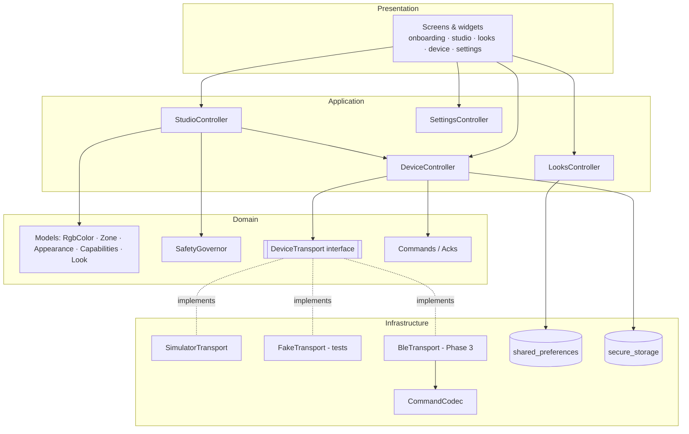
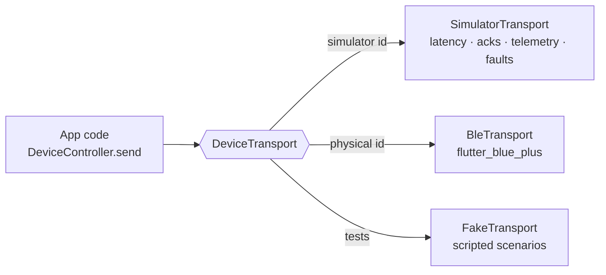
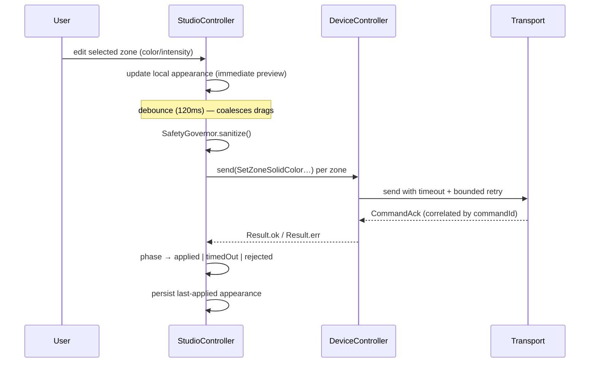

# Architecture

Feature-first clean architecture. The guiding constraint: **UI and business
logic never depend on the BLE package** — they talk to a `DeviceTransport`
interface, so the simulator, a test fake, and the physical BLE transport are
drop-in interchangeable.

## Layers

## Transport seam (simulator vs physical)

`TransportFactory.createFor(DeviceRef)` selects the implementation. Nothing above
the factory branches on transport type.

## Frame state synchronization

## 3D preview strategy

The reliable default is a **custom-painted 2D vector frame**
(`shared/widgets/frame_preview.dart`) with independently addressable zone
materials, selection highlight, tap-to-select and optical proportions. It is
also the **graceful fallback** for the future 3D view.

Replacement point for real 3D: introduce `FramePreview3D` behind the same inputs
(`FrameAppearance`, `supportedZones`, `selection`, `onSelectZone`). A GLB asset
with named materials `frame_front`, `temple_left`, `temple_right`, `lenses`,
`hinges` drops into `assets/models/`; the loader tints each material from the
matching `ZoneAppearance`. On init failure or low-end devices, fall back to the
2D `FramePreview`. See IMPLEMENTATION-STATUS (Phase 5) and HARDWARE-INTEGRATION.

## Key decisions
- **No code-gen** (Freezed/json_serializable/riverpod_generator) — hand-written
  immutable models + manual providers. Rationale in ADR 0002/0003.
- **Result over exceptions** at every layer boundary.
- **Capability-driven UI** — unsupported features render "Not supported", never
  faked.
- **Safety as a layer** — `SafetyGovernor` clamps toward safe values before send
  and reports every adjustment; firmware remains authoritative.
