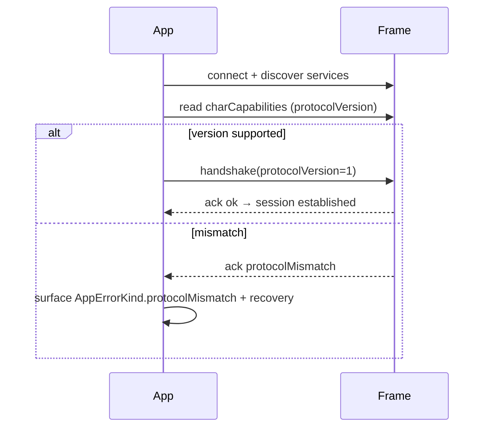
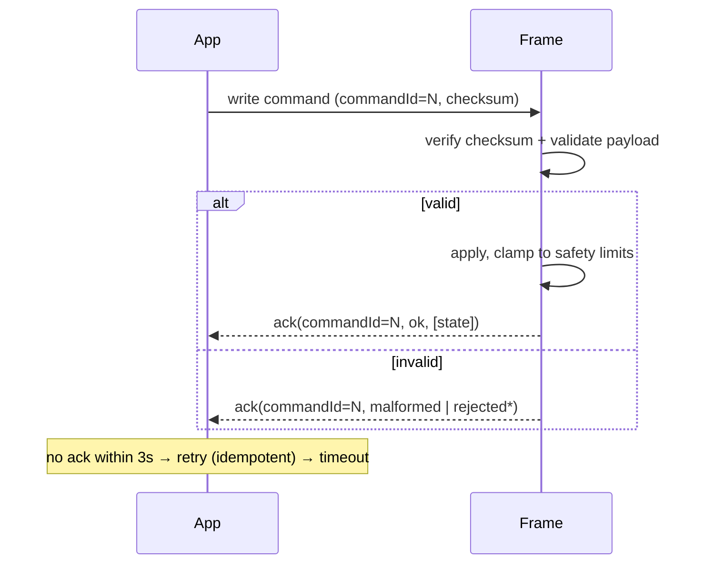

# Shade Shifter BLE Protocol — v1 (DRAFT)

> **Status: DRAFT for joint agreement with firmware.** All UUIDs are
> **development placeholders** (`lib/core/ble/ble_ids.dart`) and MUST be
> confirmed with the firmware team before any production build. Encoding is
> versioned; unknown versions are rejected via negotiation.

## Design choices
- **Compact binary** on the wire (not JSON). Fixed-size header + small payloads
  keep within a single BLE MTU and are cheap to parse on the ESP32. JSON is used
  only for simulator/debug logging.
- **Big-endian** multi-byte integers.
- **Idempotent commands** — every command sets absolute state, so a retry after a
  lost ack is safe.
- Authoritative implementation: `lib/core/ble/command_codec.dart` +
  `protocol.dart`. Test vectors: `test/command_codec_test.dart`.

## GATT services / characteristics (placeholder UUIDs)
Vendor 128-bit base, prefix `0x5348534F` ("SHSO").

| Role | Characteristic | Props | UUID (dev) |
|------|----------------|-------|------------|
| Device information | `charDeviceInfo` | Read | `…-0002-…` |
| Capabilities | `charCapabilities` | Read | `…-0003-…` |
| Command write | `charCommandWrite` | Write | `…-0004-…` |
| Command ack | `charCommandAck` | Notify | `…-0005-…` |
| Current state | `charCurrentState` | Read/Notify | `…-0006-…` |
| Telemetry | `charTelemetry` | Notify | `…-0007-…` |
| Firmware update | `charFirmwareUpdate` | Write | `…-0008-…` (placeholder) |

Service UUID `5348534f-0001-4000-8000-536861646572`. Devices advertise a name
beginning `ShadeShifter` (`BleIds.deviceNamePrefix`).

## Command frame layout

```
offset size field
  0     1    protocolVersion
  1     1    messageType   (CommandType.wire)
  2     2    commandId     (uint16, correlates ack)
  4     4    sequence      (uint32, monotonic)
  8     1    targetZone    (ZoneId.wire; 0x00 = n/a)
  9     1    payloadLength (L; ≤ 512)
 10     L    payload
10+L    1    checksum      (XOR of bytes 0..10+L-1)
```

### Message types (`messageType`)
| Cmd | Byte | Payload |
|-----|------|---------|
| handshake | `0x01` | `[protocolVersion]` |
| readCapabilities | `0x02` | — |
| readCurrentState | `0x03` | — |
| setZoneSolidColor | `0x10` | `R,G,B,intensity` (4 B) |
| setZoneGradient | `0x11` | `Rs,Gs,Bs,Re,Ge,Be,dir,intensity` (8 B) |
| setZoneIntensity | `0x12` | `intensity` (1 B) |
| setEffect | `0x13` | `effect,speed` (2 B) |
| applyLook | `0x14` | `count, {zone,mode,R,G,B,effect,intensity}×count` |
| illuminationOff | `0x1F` | — |
| renameDevice | `0x20` | `len, utf8[len≤30]` |
| ping | `0x30` | — |
| enterFirmwareUpdate | `0x40` | (placeholder) |

- **Color**: three 8-bit channels R,G,B. Intensity is a **separate** byte
  (`round(unit×255)`), never premultiplied into the channels.
- **Zone ids**: front `0x01`, leftTemple `0x02`, rightTemple `0x03`.
- **Effect ids**: static `0x00`, gentlePulse `0x01`, colorShift `0x02`,
  breathing `0x03`.

### Test vector — `setZoneSolidColor`, front, `#7C5CFF`, intensity 0.6
`commandId=1, sequence=1` →
`01 10 00 01 00 00 00 01 01 04 7C 5C FF 99 52`
(checksum `0x52`). Verified in `test/command_codec_test.dart`.

## Acknowledgement
Notification on `charCommandAck`, correlated by `commandId`. Status codes:

| Status | Byte |
|--------|------|
| ok | `0x00` |
| rejectedUnsafe | `0x01` |
| rejectedUnsupported | `0x02` |
| malformed | `0x03` |
| busy | `0x04` |
| protocolMismatch | `0x05` |

## Timeouts, retries, idempotency
- Client command timeout: **3 s** (`DeviceController._commandTimeout`).
- Retries: up to **2**, only for transient failures (`commandTimeout`, `busy`),
  with backoff `150ms × attempt`. Safe because commands are idempotent.
- Continuous UI controls are **debounced 120 ms** before transmit.

## Fragmentation
Payloads ≤ MTU are sent whole. `applyLook` and future large payloads that exceed
the negotiated MTU are fragmented into `⌈L/mtu⌉` chunks with a continuation flag
in a reserved header bit (to be finalized with firmware; not yet needed for
Rev-A's ≤ 3 zones).

## Version negotiation



## Unsupported command / capability
A device that receives an unknown `messageType` or an unsupported feature
replies `rejectedUnsupported`. The app never sends a feature absent from the
capability response; it renders such features as "Not supported".

## Command / ack flow



## Security notes
Pairing for the POC is unauthenticated. Production must add authenticated,
replay-resistant control and signed firmware updates — see
SECURITY-THREAT-MODEL.md for the gap analysis.
