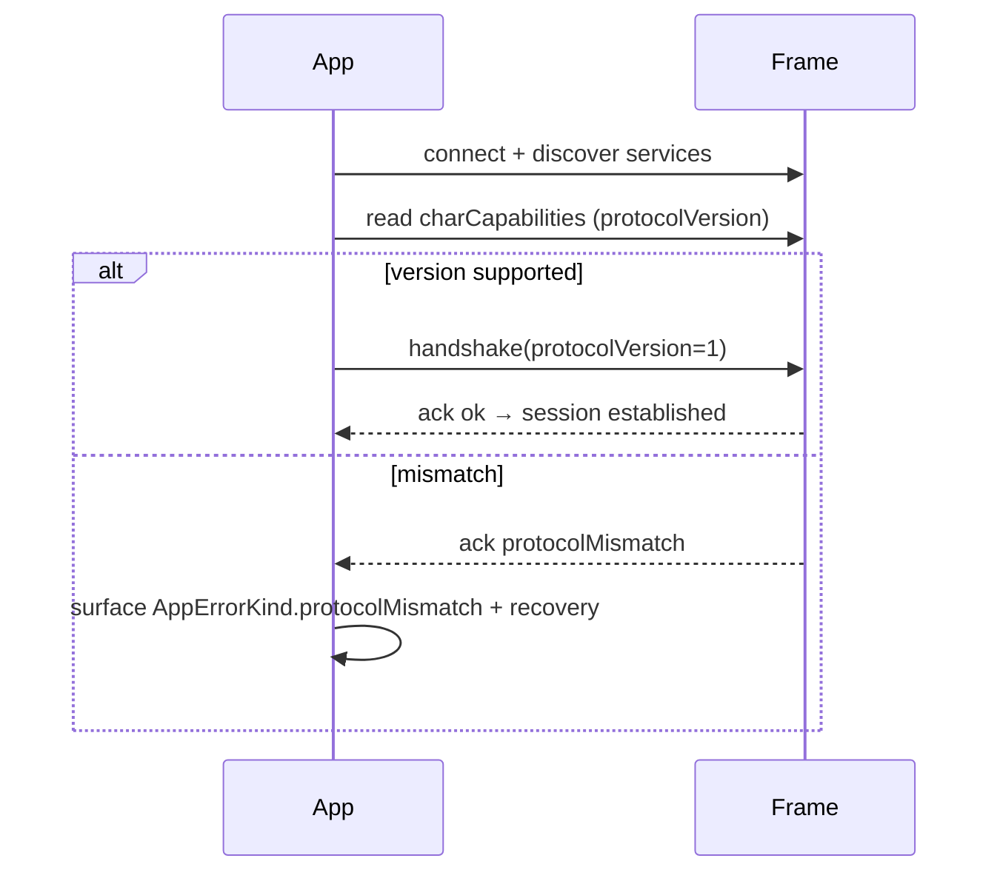
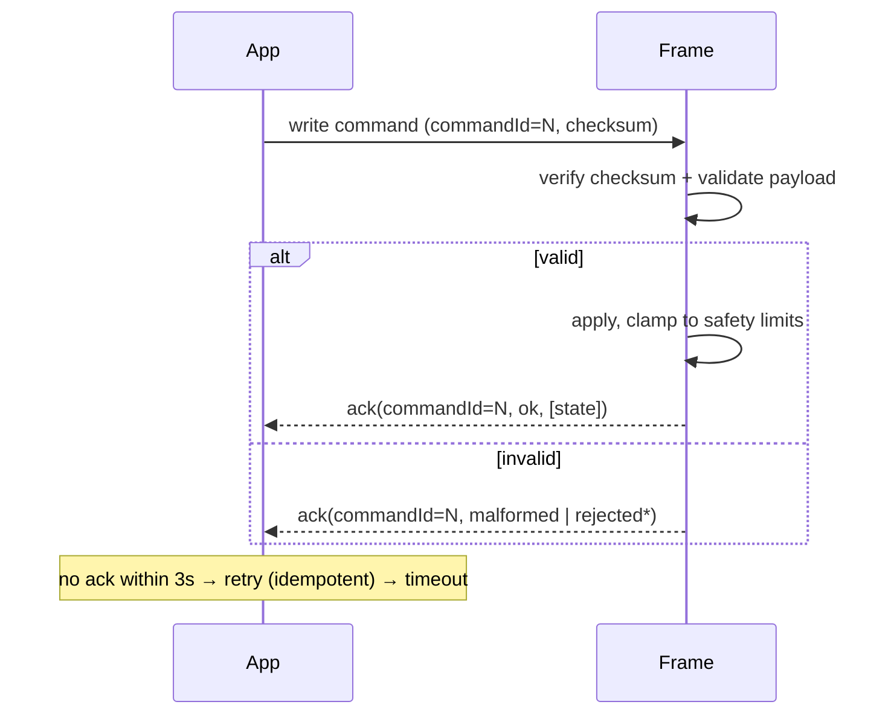

# Shade Shifter BLE Protocol

Two profiles exist, and the app is capability-driven so it only offers what the
connected profile supports:

1. **Rev-A legacy** — the contract the bench firmware ACTUALLY implements today.
   Authoritative; matches real silicon.
2. **Packet-v1** — a richer, versioned contract (below). PROPOSED, not yet in
   any firmware; UUIDs are development placeholders to agree with firmware.

---

## Rev-A legacy contract (AUTHORITATIVE — as implemented)

Source of truth: `hardware/blueprint-plan/firmware/shade_shifter_bench.ino`
(NimBLE + Adafruit_NeoPixel, 24 WS2812B LEDs). App side:
`DeviceCapabilities.revALegacy` + `BleIds.serviceRevA`/`charRevAColor`.

| Item | Value |
|------|-------|
| Advertised name | `ShadeShifter-POC` (prefix `ShadeShifter`) |
| Service UUID | `7f4a0001-9d45-4d9e-b890-9f132c08a001` |
| Color characteristic | `7f4a0002-9d45-4d9e-b890-9f132c08a001` (READ \| WRITE) |
| Payload | exactly **3 bytes: R, G, B** (whole frame). Any other length is ignored. |
| Brightness | **fixed firmware-side at 32/255 (~12.5%)** — NOT in the payload, not app-adjustable |
| Zones / gradient / effects | none — whole frame, one solid color |
| Ack | none — Write, then optionally READ the color characteristic to confirm |
| Telemetry / capabilities / firmware-update | none |

Because there is no capability or ack characteristic, the app applies the
`revALegacy` profile **statically** for a Rev-A device (no negotiation), degrades
the UI to whole-frame solid color, and treats a successful write (optionally
read-back verified) as "applied".

### Brightness on Rev-A: premultiplied, unlike packet-v1

Rev-A's global brightness is fixed in firmware and the payload carries no
intensity byte, so **scaling the three colour channels is the only way the app
can dim the frame**. `BleTransport` therefore expresses intensity as a fraction
of the firmware ceiling and premultiplies it into R,G,B:

```
scale   = clamp(intensity / caps.maxIntensity, 0, 1)   // maxIntensity = 32/255
channel = round(channel × scale)
```

So a request at the ceiling writes full-scale channels (which the frame renders
at its fixed 12.5 %), half the ceiling writes half-scale channels, and zero
writes `00 00 00` — genuinely dark rather than "dark in the UI only". The app
can never exceed the firmware cap, because `scale` is clamped to 1.

> This is the **opposite** of the packet-v1 rule below, where intensity is a
> separate byte and must never be premultiplied. The two profiles differ because
> packet-v1 firmware applies intensity itself; Rev-A cannot.

Gradients are written as the midpoint blend of start and end rather than
rejected, matching the `SafetyGovernor` notice that the frame "renders gradients
as a solid blend". Animated effects, temple zones and rename are refused with
`rejectedUnsupported` — the app never pretends to apply what the frame cannot do.

> Reconcile before changing: any edit here must match the firmware, or the
> firmware must change in the same PR.

---

## Packet-v1 (PROPOSED — richer versioned contract, not in firmware yet)

## Design choices
- **Compact binary** on the wire (not JSON). Fixed-size header + small payloads
  keep within a single BLE MTU and are cheap to parse on the ESP32. JSON is used
  only for simulator/debug logging.
- **Big-endian** multi-byte integers.
- **Idempotent commands** — every command sets absolute state, so a retry after a
  lost ack is safe.
- Authoritative implementation: `lib/core/ble/command_codec.dart` +
  `protocol.dart`. Test vectors: `test/command_codec_test.dart`.

## GATT services / characteristics (packet-v1 placeholder UUIDs)
Vendor 128-bit base, prefix `0x5348534F` ("SHSO"). Constant
`BleIds.servicePacketV1`. These are NOT the Rev-A firmware UUIDs above.

| Role | Characteristic | Props | UUID (dev) |
|------|----------------|-------|------------|
| Device information | `charDeviceInfo` | Read | `…-0002-…` |
| Capabilities | `charCapabilities` | Read | `…-0003-…` |
| Command write | `charCommandWrite` | Write | `…-0004-…` |
| Command ack | `charCommandAck` | Notify | `…-0005-…` |
| Current state | `charCurrentState` | Read/Notify | `…-0006-…` |
| Telemetry | `charTelemetry` | Notify | `…-0007-…` |
| Firmware update | `charFirmwareUpdate` | Write | `…-0008-…` (placeholder) |

Packet-v1 service UUID `5348534f-0001-4000-8000-536861646572`
(`BleIds.servicePacketV1`). Devices advertise a name beginning `ShadeShifter`
(`BleIds.deviceNamePrefix`) — the Rev-A firmware advertises `ShadeShifter-POC`.

## Command frame layout

```
offset size field
  0     1    protocolVersion
  1     1    messageType   (CommandType.wire)
  2     2    commandId     (uint16, correlates ack)
  4     4    sequence      (uint32, monotonic)
  8     1    targetZone    (ZoneId.wire; 0x00 = n/a)
  9     1    payloadLength (L; ≤ 512)
 10     L    payload
10+L    1    checksum      (XOR of bytes 0..10+L-1)
```

### Message types (`messageType`)
| Cmd | Byte | Payload |
|-----|------|---------|
| handshake | `0x01` | `[protocolVersion]` |
| readCapabilities | `0x02` | — |
| readCurrentState | `0x03` | — |
| setZoneSolidColor | `0x10` | `R,G,B,intensity` (4 B) |
| setZoneGradient | `0x11` | `Rs,Gs,Bs,Re,Ge,Be,dir,intensity` (8 B) |
| setZoneIntensity | `0x12` | `intensity` (1 B) |
| setEffect | `0x13` | `effect,speed` (2 B) |
| applyLook | `0x14` | `count, {zone,mode,R,G,B,effect,intensity}×count` |
| illuminationOff | `0x1F` | — |
| renameDevice | `0x20` | `len, utf8[len≤30]` |
| ping | `0x30` | — |
| enterFirmwareUpdate | `0x40` | (placeholder) |

- **Color**: three 8-bit channels R,G,B. Intensity is a **separate** byte
  (`round(unit×255)`), never premultiplied into the channels.
- **Zone ids**: front `0x01`, leftTemple `0x02`, rightTemple `0x03`.
- **Effect ids**: static `0x00`, gentlePulse `0x01`, colorShift `0x02`,
  breathing `0x03`.

### Test vector — `setZoneSolidColor`, front, `#7C5CFF`, intensity 0.6
`commandId=1, sequence=1` →
`01 10 00 01 00 00 00 01 01 04 7C 5C FF 99 52`
(checksum `0x52`). Verified in `test/command_codec_test.dart`.

## Acknowledgement
Notification on `charCommandAck`, correlated by `commandId`. Status codes:

| Status | Byte |
|--------|------|
| ok | `0x00` |
| rejectedUnsafe | `0x01` |
| rejectedUnsupported | `0x02` |
| malformed | `0x03` |
| busy | `0x04` |
| protocolMismatch | `0x05` |

## Timeouts, retries, idempotency
- Client command timeout: **3 s** (`DeviceController._commandTimeout`).
- Retries: up to **2**, only for transient failures (`commandTimeout`, `busy`),
  with backoff `150ms × attempt`. Safe because commands are idempotent.
- Continuous UI controls are **debounced 120 ms** before transmit.

## Fragmentation
Payloads ≤ MTU are sent whole. `applyLook` and future large payloads that exceed
the negotiated MTU are fragmented into `⌈L/mtu⌉` chunks with a continuation flag
in a reserved header bit (to be finalized with firmware; not yet needed for
Rev-A's ≤ 3 zones).

## Version negotiation



## Unsupported command / capability
A device that receives an unknown `messageType` or an unsupported feature
replies `rejectedUnsupported`. The app never sends a feature absent from the
capability response; it renders such features as "Not supported".

## Command / ack flow



## Security notes
Pairing for the POC is unauthenticated. Production must add authenticated,
replay-resistant control and signed firmware updates — see
SECURITY-THREAT-MODEL.md for the gap analysis.
