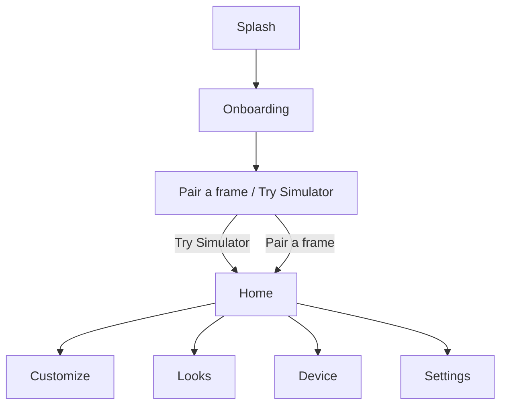
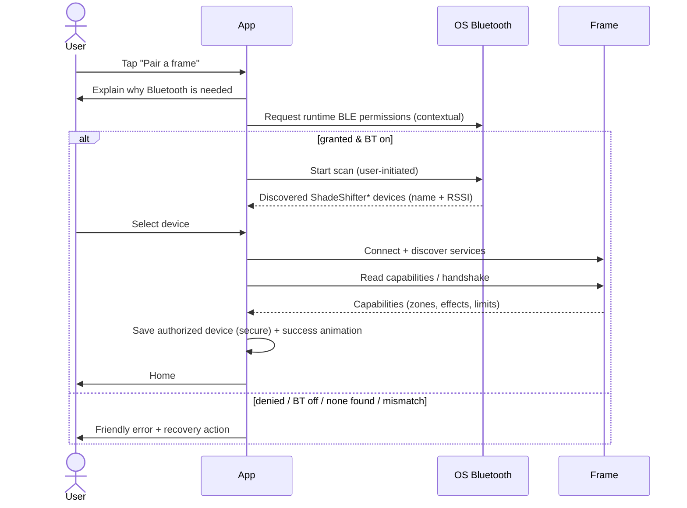
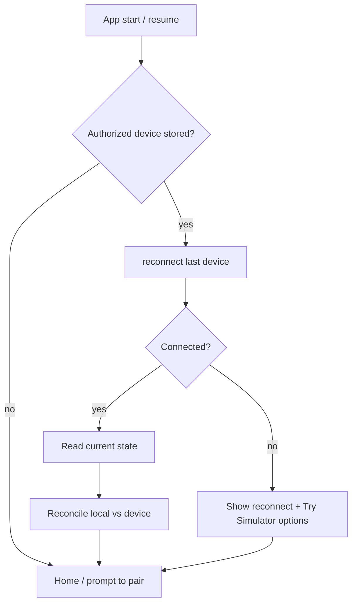

# UX Flows

## Navigation map

Home is a 4-tab shell (`IndexedStack`): **Customize · Looks · Device · Settings**.
Bluetooth permission is **not** requested on launch — only contextually at
pairing.

## Onboarding
Five pages: one frame/many looks → whole-frame & zone customization → saved looks
→ Bluetooth control (with the "only asked at pairing" promise) → simulator
availability. Skippable; completion is persisted so returning users land on Home.

## Pairing sequence

Handled error states (each with a recovery action): Bluetooth disabled,
permission denied, permanently denied (→ open settings), Android location
requirement, no devices found (→ retry), unsupported firmware, protocol mismatch,
connection timeout (→ retry), device busy elsewhere, unexpected disconnect.
_POC note: physical scanning is the Phase 3 `BleTransport`; today "Pair a frame"
explains this and routes to the simulator, which mirrors these states._

## Reconnection flow

## Customization interaction
Immediate local preview on every edit; continuous controls (hue, intensity) are
**debounced 120 ms** before a rate-limited BLE send. The apply-state chip shows:
Previewing → Pending → Sending → Acknowledged → Applied, or Timed out / Rejected
/ Reverted. Selecting a zone (chips or tapping the preview) scopes edits;
"Whole frame" and "Both temples" fan out to multiple physical zones while
preserving each zone's own configuration.

## Safety UX
- Safe default intensity on first connection.
- App brightness ceiling (Settings) layered under firmware max.
- Safety notices banner explains any auto-adjustment (clamped/thermal/effect).
- Prominent emergency **illumination-off** button on Customize.
- "Experimental hardware — POC" labelling at pairing and on Device.
