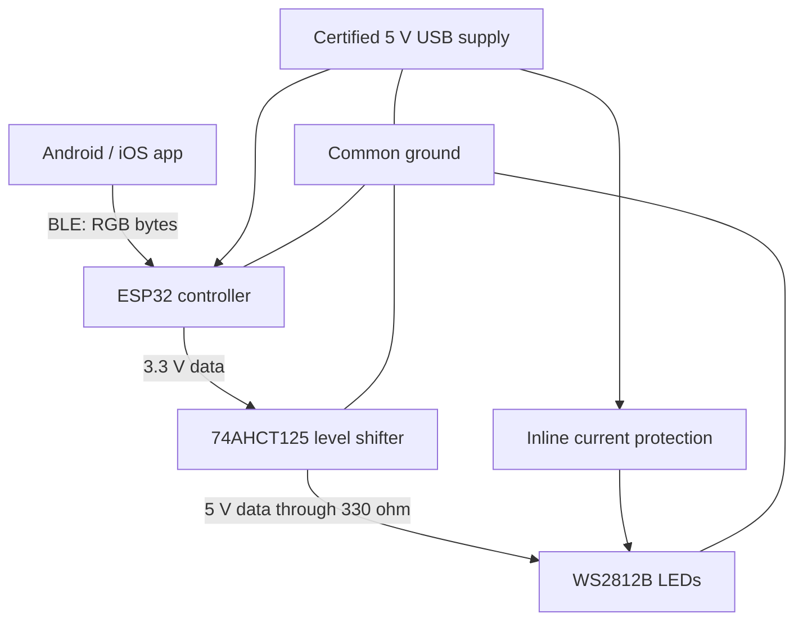
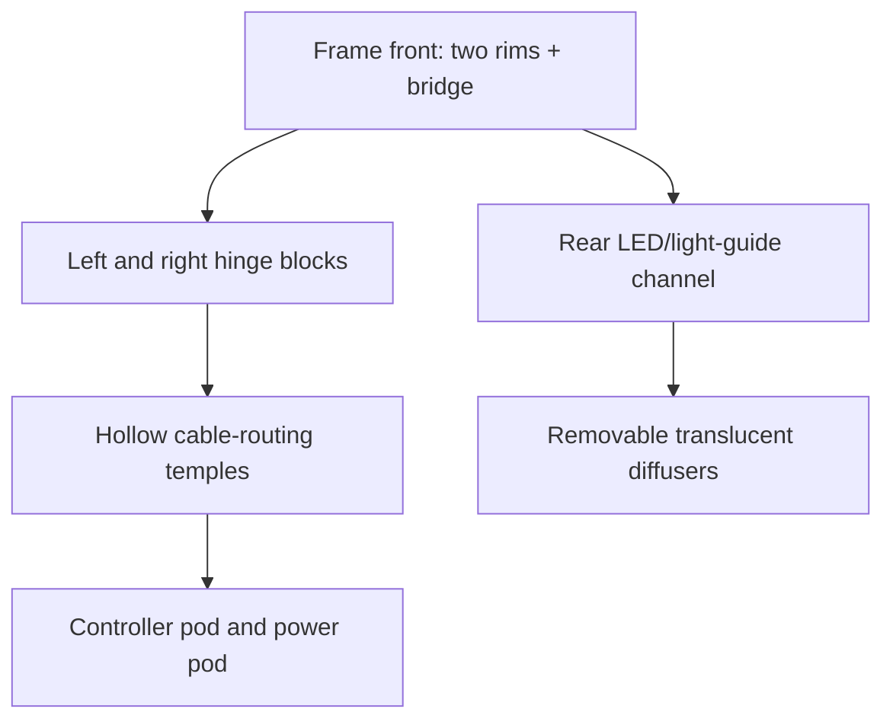
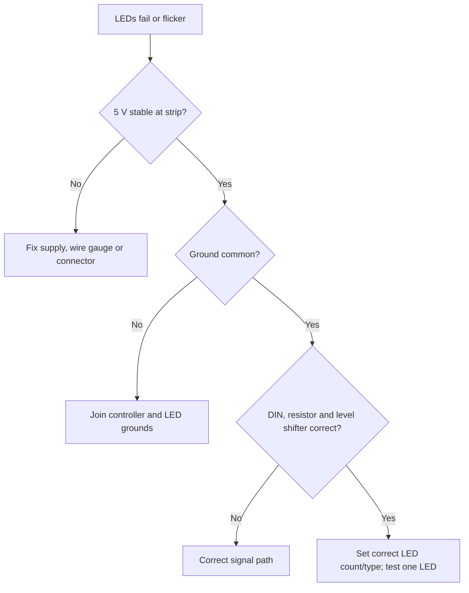

# Shade Shifter POC Build Blueprint — Rev A

Audience: software engineer with no prior hardware experience. Currency: INR. Measurements: millimetres unless stated.

## 1. Definition of success

The POC passes only when it demonstrates all of the following:

- A phone can connect by Bluetooth and set solid colours in under one second.
- The bench circuit runs for 60 minutes without resets, flicker, hot wiring or connector damage.
- Current draw is measured for black, white, red, green, blue and a gradient animation.
- A printed frame fits the intended wearer and has sufficient volume for wiring and sealed electronics.
- The wearable alpha remains below 40 °C at skin-contact surfaces during a 30-minute test.
- Light is diffused outward and does not create distracting direct glare toward the eyes.
- Power can be physically disconnected; charging is impossible while worn.

The POC does **not** prove prescription certification, waterproofing, production battery life, impact safety, mass manufacturing, or electrochromic colour-changing material.

## 2. Stage gates and maximum spend

| Gate | Spend ceiling | Work | Pass condition | Buy next? |
|---|---:|---|---|---|
| 0: paper review | ₹0 | Read guide; verify parts and safety | You can identify every pin and wire | Buy bench parts only |
| 1: simulated/software | ₹0 | Compile firmware; plan BLE payload | Firmware builds; RGB is three bytes | Buy ESP32 + 8-pixel test ring/strip |
| 2: USB bench light | ₹3,500–₹7,500 | Breadboard circuit, USB powered | 60-min stable run; current recorded | Buy soldering/fit-check items |
| 3: fit check | ₹1,500–₹3,700 extra | Measure existing frame; cheap PLA print | Fit, sightline, temple and pod volumes accepted | Buy PA12 print and compact electronics |
| 4: tethered wearable | ₹6,000–₹13,000 extra | Frame powered by pocket USB bank | Thermal/glare/comfort test passes | Buy protected battery system |
| 5: battery wearable | ₹3,000–₹7,000 extra | Sealed battery and charger module | Independent electrical review + abuse tests | Consider custom PCB |

Stop whenever a gate fails. Correct the design before purchasing the next stage.

## 3. Tools you must understand first

### Multimeter essentials

1. Black lead goes to `COM`; red lead goes to `VΩ` for voltage/resistance.
2. Measure voltage **in parallel**. Select DC volts and touch probes across 5V and GND.
3. Measure resistance only with all power disconnected.
4. Never move the red lead into the current jack unless following a supervised current-measurement setup. A mistaken parallel current measurement creates a short.
5. For early current tests, use an inline USB power meter instead of the multimeter current mode.

Practice: measure a fresh AA cell, a USB 5V output, and continuity of an unpowered jumper wire.

### Breadboard essentials

- Each group of five holes on a terminal strip is internally connected.
- Power rails may be split halfway; verify continuity rather than assuming.
- Red/blue markings are labels, not electrical protection.
- Disconnect USB power before moving wires.

### Soldering essentials

- Learn on spare header pins, never first on the compact wearable board.
- Work with extraction/ventilation and eye protection.
- Tin the iron, heat pad and wire together, feed a small amount of solder, then remove solder and iron.
- A good joint is smooth and mechanically stable. Tug-test after cooling.
- Cover every exposed joint with heat shrink; do not rely on tape.

## 4. Electrical architecture



### Exact bench wiring

Power must be off while wiring.

| From | To | Purpose |
|---|---|---|
| USB/ESP32 `5V` or external regulated `5V` | LED `5V`; 74AHCT125 `VCC` | Power |
| ESP32 `GND` | LED `GND`; 74AHCT125 `GND` | Common reference |
| ESP32 `GPIO5` | 74AHCT125 input `1A` | Colour data |
| 74AHCT125 output `1Y` | 330 Ω resistor, then LED `DIN` | Reliable 5V data |
| 74AHCT125 enable `1OE` | GND | Enable channel |
| 1000 µF capacitor `+` | LED 5V near strip start | Surge suppression |
| 1000 µF capacitor `−` | LED GND near strip start | Observe polarity |

Never connect data to `DOUT`. The arrows on the strip point away from the controller.

### Power budget

WS2812B worst-case planning value is about 60 mA per LED at full white. For 24 LEDs:

`24 × 0.060 A = 1.44 A`, before controller losses.

Rev A firmware limits brightness to 32/255 (12.5%). Still size bench wiring and supply conservatively, measure actual current, and add a firmware ceiling. For the wearable, use fewer LEDs or a more efficient light-guide design. Full white at unrestricted brightness is prohibited.

## 5. Bench build tutorial

### Step A — visual inspection

1. Check the ESP32 board and LED strip for bent pins, solder bridges and torn pads.
2. Photograph both sides and record model numbers.
3. Find the ESP32 pinout from the exact board vendor; clone boards can differ.
4. Confirm the LED order is `5V / DIN / GND`, not another vendor order.

### Step B — controller-only test

1. Install Arduino IDE 2.x.
2. Add Espressif's ESP32 board package using its official Boards Manager URL.
3. Install `Adafruit NeoPixel` and `NimBLE-Arduino` through Library Manager.
4. Open `firmware/shade_shifter_bench.ino`.
5. Select the exact ESP32 board and serial port.
6. Compile before connecting LEDs. Upload and confirm no upload error.

### Step C — power-off resistance tests

With all USB cables removed:

- Check that 5V and GND are not shorted. A brief changing reading caused by capacitor charging can be normal; a steady near-zero reading is not.
- Check each jumper end-to-end for continuity.
- Confirm capacitor polarity twice.

### Step D — first light

1. Connect only 1–8 LEDs, not the full strip.
2. Place the inline USB power meter between supply and circuit.
3. Power on while keeping a hand near the connector—not on bare conductors—ready to disconnect.
4. The initial colour should be dim blue.
5. Disconnect immediately for smell, smoke, repeated resets, a rapidly warming wire or current above the calculated limit.

### Step E — BLE test without an app

Use a reputable BLE debugging app such as nRF Connect during development:

1. Scan for `ShadeShifter-POC`.
2. Connect and locate service `7f4a0001-9d45-4d9e-b890-9f132c08a001`.
3. Write three raw bytes to characteristic `...0002`: `FF 00 00` for red, `00 FF 00` for green, `00 00 FF` for blue.
4. The firmware brightness cap remains active even when `FF` is written.

### Step F — endurance matrix

Record results every 10 minutes for 60 minutes.

| Test | RGB command | Expected |
|---|---|---|
| Off | `00 00 00` | LEDs dark; controller remains connected |
| Red | `FF 00 00` | Uniform red |
| Green | `00 FF 00` | Uniform green |
| Blue | `00 00 FF` | Uniform blue |
| White | `FF FF FF` | Dim capped white; highest current |

Log USB volts, amps, ESP32 resets, visible flicker, connector temperature and ambient temperature.

## 6. Mobile app contract

Use Flutter for one Android/iOS codebase. Keep the first UI intentionally small:

- Device scan/connect screen
- Colour wheel plus eight presets
- Brightness slider limited to an administrator-defined safe maximum
- Disconnect/off button
- Connection and battery status

BLE payload for Rev A is exactly three unsigned bytes `[red, green, blue]`, each 0–255. The app does not control the hardware brightness ceiling. Later versions can add a versioned packet: `[version, command, payload..., checksum]`.

Do not begin polished app development until nRF Connect can reliably control the bench circuit. This separates firmware/electrical faults from app faults.

## 7. CAD measurements and fit workflow

The starting geometry approximates a large `55–18–145` rectangular frame:

- Lens width: 55 mm each
- Bridge: 18 mm
- Temple length: 145 mm
- Lens height: 39 mm
- Structural rim: 5 mm
- Front depth: 6 mm

Before printing, measure a comfortable existing frame with a digital caliper:

1. Total front width, hinge-to-hinge.
2. Lens box width and height.
3. Bridge distance and nose-pad contact.
4. Temple length to bend and overall length.
5. Hinge block width, thickness and screw diameter.
6. Distance from hinge to ear and available electronics-pod area.

Update variables at the top of `cad/shade_shifter_rev_a.scad`. OpenSCAD is free; choose a part, render with F6, then export STL.

### Printed parts



Rev A deliberately leaves the hinge mechanical detail generic. Online print tolerances and selected metal hinges determine the final screw bosses. For the fit print, use a removable pin or tape fixture only; do not trust a printed hinge for daily wear.

### Online printing sequence

1. Send `cad/PRINTING-RFQ.md` and the fit-check STLs to two services.
2. Order the cheapest FDM fit set first.
3. Test for 15 minutes with no electronics, no prescription lenses and no battery.
4. Mark pressure points, visibility obstruction, nose slip and temple length.
5. Revise CAD and repeat if any issue exceeds 1–2 mm.
6. Only then request SLS/MJF PA12 and separate translucent diffusers.

## 8. Tethered wearable assembly

The first wearable must use a certified USB power bank in a pocket with a breakaway cable. This keeps the battery away from the face.

Assembly order:

1. Dry-fit all printed parts and confirm there are no sharp skin-facing edges.
2. Install unpowered diffuser samples; inspect inward glare under room and dark conditions.
3. Route flexible wires through temples with rounded strain relief.
4. Mount LEDs facing outward into the light channel; never toward the eye.
5. Mount controller in the temple pod using removable non-conductive retention.
6. Add locking connectors so front and temples can separate without pulling solder joints.
7. Perform continuity and 5V-to-GND short tests.
8. Power on at the firmware brightness cap while the frame is on a nonflammable bench.
9. Run 30 minutes and measure every exterior contact surface.
10. Only after passing, place it on a foam head form; repeat glare and thermal tests.
11. A person may wear it briefly only after an experienced electronics reviewer checks the assembly.

## 9. Battery wearable — separate high-risk gate

Do not improvise this subsystem from a loose marketplace cell. Requirements:

- Traceable protected LiPo with datasheet, protection circuit and supplier documentation.
- Charger with power-path/load-sharing behaviour; charging and operation must be intentionally controlled.
- Overcurrent protection, physical power switch, strain relief and a rigid flame-retardant enclosure.
- Cell located away from temple pressure points and shielded from puncture/bending.
- No charging while worn, unattended or overnight.
- External charge port cannot expose conductive contacts to sweat.
- Independent design review before human wear.

Battery runtime estimate:

`runtime hours ≈ battery mAh × 0.8 / measured average load mA`

The 0.8 factor is only a first planning allowance. Verify with real discharge tests in a fire-safe test location. A five-day commercial target is not realistic for continuously illuminated RGB LEDs; the experience POC should use short sessions and aggressive auto-off.

## 10. Thermal, optical and mechanical tests

### Thermal

- Measure ambient, LED channel, controller pod and every skin-contact surface.
- Test off, normal preset, animation, and worst allowed white.
- Stop if temperature rises rapidly, exceeds the component rating, or any skin-contact surface reaches 40 °C in this conservative POC gate.

### Optical

- Inspect in daylight, office light and a dark room.
- No bare LED should be visible directly from the wearer’s normal gaze.
- Check internal reflections on plano lenses.
- Avoid flashing patterns; do not test on people with photosensitive epilepsy risk.
- Add auto-dim/auto-off before public demonstrations.

### Mechanical

- 100 gentle temple open/close cycles on the bench.
- Cable tug test at every connector and solder joint.
- 15-minute comfort test with electronics off.
- Low-height drop testing on an empty frame only; remove battery first.
- Do not claim impact resistance from a prototype test.

### Sweat/moisture simulation

Use a removable exterior sample and artificial-perspiration test protocol appropriate to later standards work. Do not spray powered electronics. For Rev A, the correct response to moisture ingress is design revision, not merely adding coating.

## 11. Troubleshooting decision tree



| Symptom | Likely cause | Safe check |
|---|---|---|
| ESP32 resets on white | Voltage sag/current spike | Lower LED count; inspect USB volts and capacitor |
| Random colours | 3.3V data level, missing common ground or long wire | Verify 74AHCT125 and shorten data wire |
| First LEDs work only | Damaged LED or wrong count | Test short segment; inspect data direction |
| BLE connects but no colour | Wrong characteristic or payload encoding | Send exactly three raw bytes |
| One wire gets warm | Undersized/poor connection or excessive current | Disconnect immediately; remake and remeasure |
| Diffuser has hotspots | LED pitch too wide or diffuser too close | Increase mixing distance/change optical channel |
| Frame slides | Bridge/temple geometry mismatch or excess weight | Revise CAD; do not add battery as counterweight |

## 12. Build log template

Create one record for every revision:

```text
Revision/date:
Builder/reviewer:
Exact board and LED SKU:
Firmware commit:
CAD commit:
Supply voltage:
LED count and brightness cap:
Measured current: off / RGB / white / animation
Ambient and maximum surface temperature:
BLE range and disconnects:
Fit and glare observations:
Faults/photos:
Gate decision: PASS / FAIL / REWORK
Approved next purchase:
```

## 13. Repository placement

Recommended canonical layout:

```text
shade-shifter/
├── documentation/
│   ├── research-analysis.md
│   └── poc-build-blueprint.md
├── hardware/
│   ├── bom/
│   ├── cad/
│   ├── stl/
│   ├── diagrams/
│   └── test-results/
└── software/
    ├── firmware/
    ├── mobile/
    └── test-tools/
```

Commit each gate separately. Tag accepted hardware revisions (`hardware-rev-a-fit`, `hardware-rev-b-tethered`) so CAD, firmware, BOM and test evidence remain traceable.

## 14. First seven working sessions

1. Read this guide; learn multimeter and breadboard basics; approve Gate 0.
2. Install Arduino tooling and compile firmware without LEDs.
3. Buy/receive only bench-stage BOM.
4. Assemble 1–8 LED circuit and perform first-light tests.
5. Add 24 LEDs, BLE control and 60-minute endurance log.
6. Measure a comfortable large frame; adjust OpenSCAD parameters.
7. Request the cheap fit-check print using the included RFQ.

Do not compress these sessions into one rushed build. The purchasing gates exist specifically to protect expensive parts and keep unsafe faults off the face.


